# Cleanvee V2 Architecture

## Overview

Cleanvee has evolved from a simple data-logging prototype (V1) to a **compliance-focused enterprise platform** (V2) with offline support, automated SLA enforcement, and privacy-first AI integration.

---

## Architecture Diagram

```mermaid
flowchart TB
    subgraph Mobile["📱 Mobile App (Flutter)"]
        NFC[NFC Tap] --> Log[CleaningLogV2]
        Camera[Photo Capture] --> AI[On-device AI]
        AI --> Log
        Log --> Offline[(Local SQLite)]
        Offline -->|SyncStatus| Cloud
    end
    
    subgraph Cloud["☁️ Firebase Backend"]
        Cloud[(Firestore)] --> Trigger[onLogCreated]
        Trigger --> Alerts[Create Alert]
        Trigger --> SLA[SLA Check]
        
        Watchdog[⏰ SLA Watchdog] -->|every 15 min| SLA
        SLA --> Alerts
    end
    
    subgraph MCP["🔐 MCP Privacy Layer"]
        Alerts --> Filter[PII Filter]
        Filter --> Gemini[Google Gemini]
        Filter --> Tickets[ServiceNow/Jira]
    end
    
    subgraph Dashboard["💻 Web Dashboard"]
        Cloud --> Realtime[Real-time Sync]
        Realtime --> LogFeed[LogFeed.tsx]
        Realtime --> FloorPlan[FloorPlan]
    end
```



---

## V1 → V2 Data Model Evolution

| Feature | V1 (cleaning_log_model.dart) | V2 (cleaning_log_model_v2.dart) |
|---------|------------------------------|----------------------------------|
| **Structure** | Generic `Map<String, dynamic>` | Strongly typed classes |
| **Offline** | No support | `SyncStatus` enum (synced/pendingUpload) |
| **Verification** | Simple map | `VerificationResult` class + `LogStatus` enum |
| **AI Data** | Generic map | `DetectedObject` with bounding boxes |
| **Location** | Not modeled | `GeoLocation` class for anti-spoofing |

### Key Classes

```dart
// Offline-first sync status
enum SyncStatus { synced, pendingUpload }

// Verification states
enum LogStatus { verified, rejected, flaggedForReview }

// AI detection result
class DetectedObject {
  final String label;
  final double confidence;
  final BoundingBox boundingBox;
}
```

---

## Backend Services

### 1. Alert Trigger (`functions/src/index.ts`)

Fires on every new cleaning log:
- **Quality Check**: Score < 70 or hazards detected → Creates `QUALITY_FAILURE` or `SAFETY_HAZARD` alert
- **SLA Recovery**: Detects if gap exceeded allowed window and marks as recovered

### 2. SLA Watchdog (`functions/src/slaMonitor.ts`)

Scheduled job running every 15 minutes:
- Checks all checkpoints for cleaning gaps
- Creates `SLA_MISSING_CLEAN` alert if > 4 hours since last clean
- Prevents duplicate alerts by checking for existing OPEN alerts

### 3. MCP Privacy Firewall (`services/mcpServer.ts`)

Model Context Protocol integration:
- **PII Filtering**: Strips worker IDs, emails, geolocations before AI access
- **Ticketing**: Auto-routes alerts to ServiceNow/Jira
- **Audit Trail**: Logs what data was filtered

---

## Frontend Components

### LogFeed.tsx

Displays real-time cleaning activity with V2 enhancements:

| Feature | Implementation |
|---------|----------------|
| **Status Badges** | Green (Verified), Red (Rejected), Amber (Review) |
| **AI Score** | Shows percentage with color coding (>80% = green) |
| **Live Sync** | Animated indicator for real-time updates |

---

## Key Capabilities

| Capability | Component | Description |
|------------|-----------|-------------|
| **Offline Usage** | `SyncStatus` enum | Store-and-forward when disconnected |
| **Automated SLA** | `slaMonitor.ts` | 15-min checks, 4-hour gap rule |
| **Enterprise Privacy** | `mcpServer.ts` | PII never reaches AI |
| **Ticketing** | ServiceNow/Jira | Auto-create incidents from alerts |

---

## Configuration

### Environment Variables

```bash
# AI
VITE_GEMINI_API_KEY=your-key

# ServiceNow (optional)
SERVICENOW_INSTANCE=your-instance.service-now.com
SERVICENOW_USERNAME=api_user
SERVICENOW_PASSWORD=api_password

# Jira (optional)
JIRA_HOST=your-company.atlassian.net
JIRA_EMAIL=api@company.com
JIRA_API_TOKEN=your-token
```

---

## File Structure

```
├── lib/models/
│   ├── cleaning_log_model.dart      # V1 (deprecated)
│   └── cleaning_log_model_v2.dart   # V2 with typed classes
├── functions/src/
│   ├── index.ts                     # Alert triggers
│   ├── slaMonitor.ts                # Watchdog scheduler
│   └── analytics.ts                 # BigQuery streaming
├── services/
│   ├── mcpServer.ts                 # MCP tool definitions
│   ├── privacy/                     # PII filtering
│   └── ticketing/                   # ServiceNow/Jira
└── components/
    ├── LogFeed.tsx                  # Live activity feed
    ├── FloorPlan.tsx                # Interactive map
    └── DashboardGrid.tsx            # Status grid view
```
